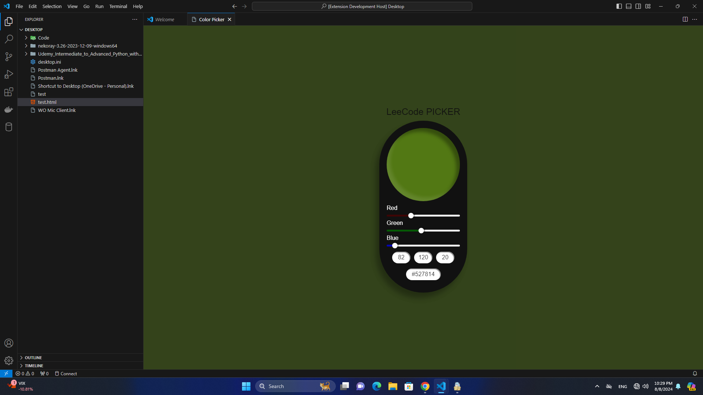

# Color Picker Extension

A simple color picker extension for Visual Studio Code that allows you to pick colors and see their values in different formats.

## Features

- Pick colors using a range slider.
- View color values in RGB and HEX formats.

## Commands

- **Show Color Picker**: Opens the color picker webview.

## Usage

Press `Ctrl+Shift+P` (or `Cmd+Shift+P` on macOS) and run the command **Color Picker: Show** to open the color picker.

## Screenshots

## License

This project is licensed under the MIT License.
